# PRC Schema SEO - Mermaid Diagrams

Visual diagrams of the data and rendering flow for the `prc-schema-seo` plugin.

## High-Level Architecture

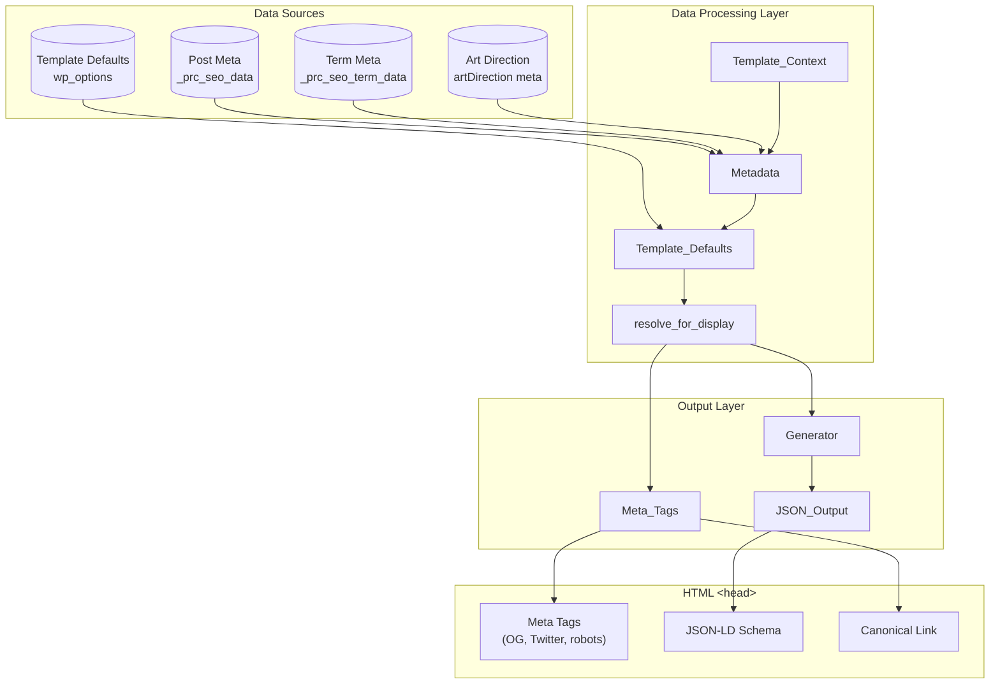

## Plugin Bootstrap

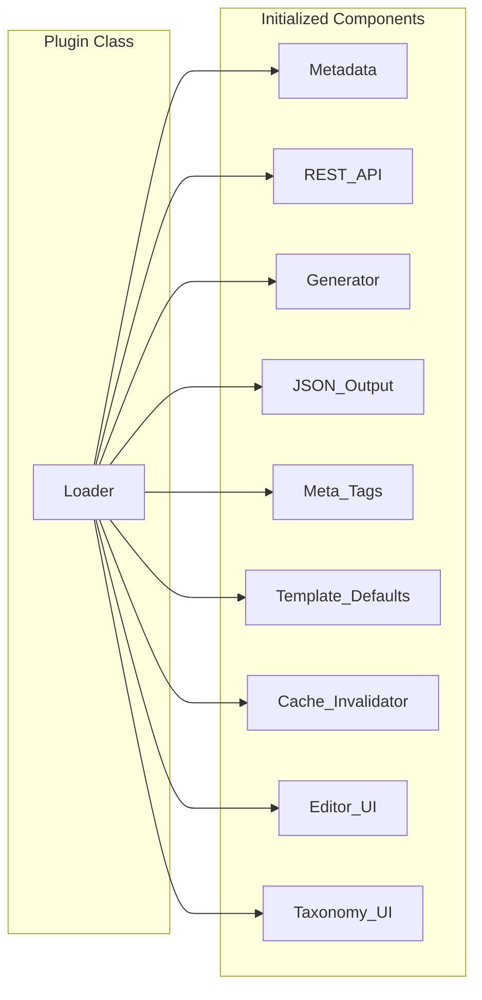

## Block Editor Data Flow

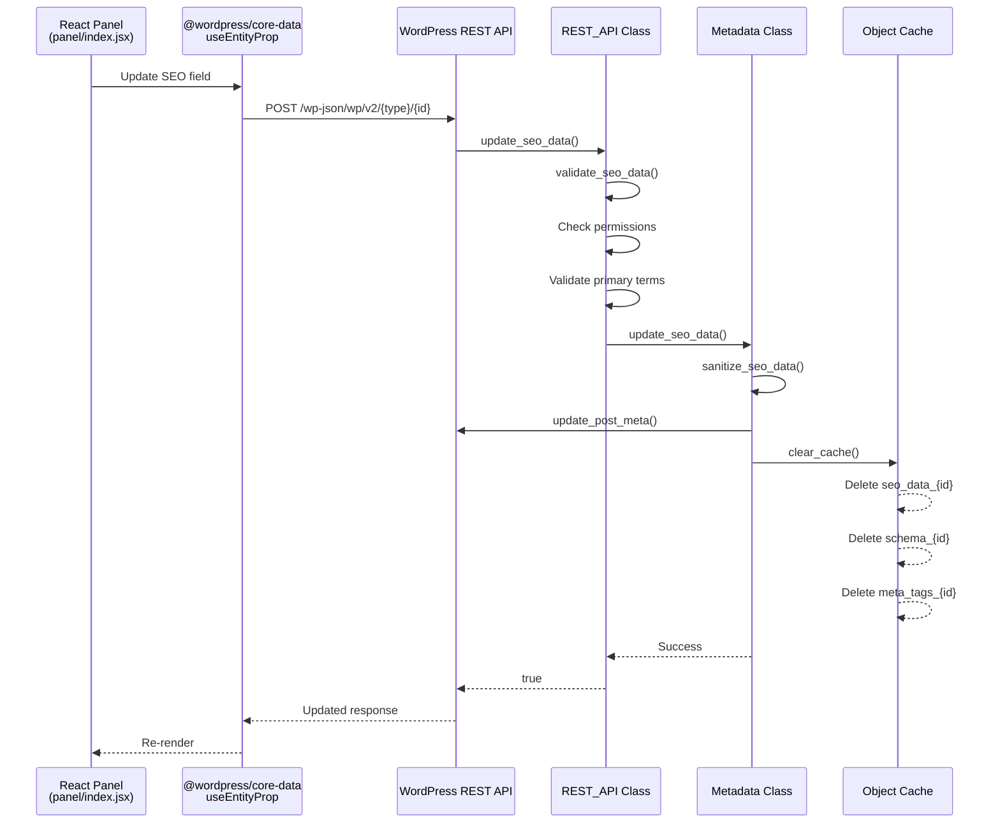

## Site Editor Template Defaults Flow

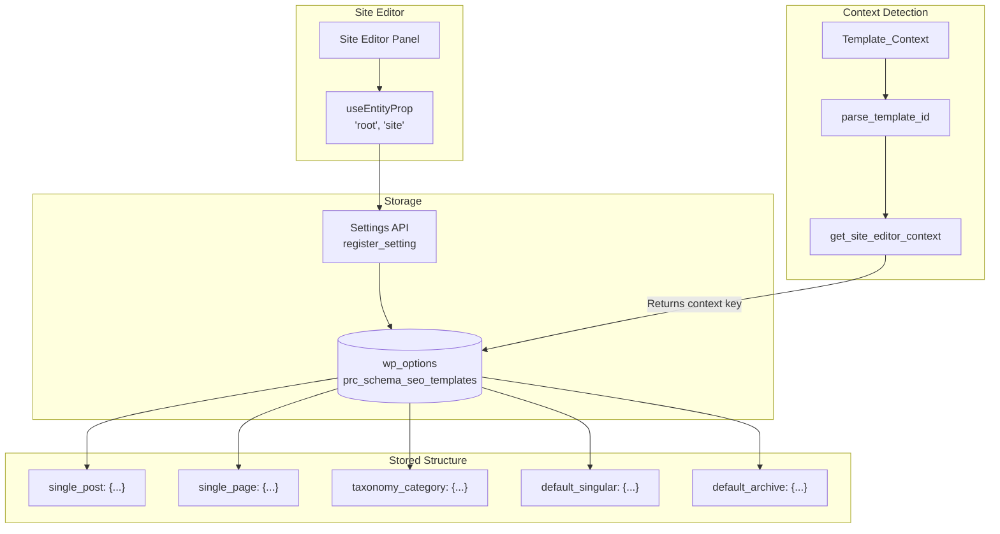

## Frontend Rendering Flow

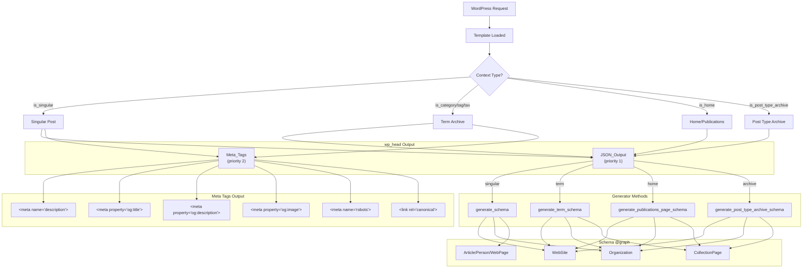

## SEO Data Resolution Chain

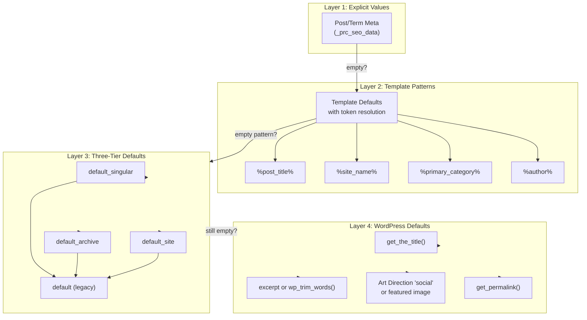

## OG Image Fallback Chain

```mermaid
flowchart TB
    START[OG Image Resolution] --> C1{Custom og_image<br/>in _prc_seo_data?}

    C1 --> |Yes| USE1[Use custom image]
    C1 --> |No| C2{Art Direction<br/>'social' slot?}

    C2 --> |Yes| USE2[Use social art image]
    C2 --> |No| C3{Featured Image<br/>(post_thumbnail)?}

    C3 --> |Yes| USE3[Use featured image]
    C3 --> |No| C4{Template Default<br/>og_image?}

    C4 --> |Yes| USE4[Use template default]
    C4 --> |No| NONE["No image<br/>twitter:card = 'summary'"]

    USE1 --> OUTPUT[Output og:image]
    USE2 --> OUTPUT
    USE3 --> OUTPUT
    USE4 --> OUTPUT
```

## Caching Architecture

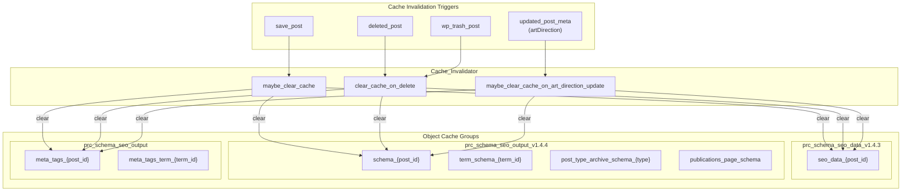

## Schema Type Mapping

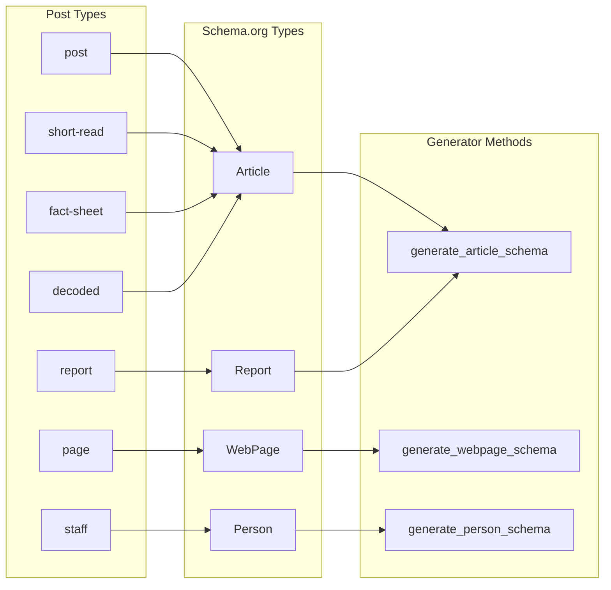

## Archive Schema Types

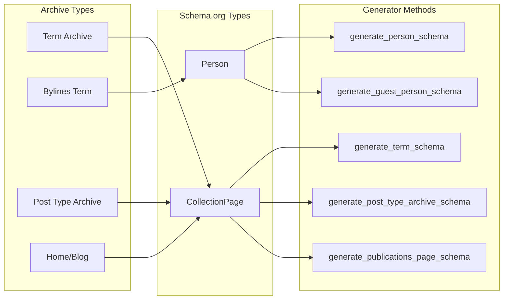

## REST API Flow

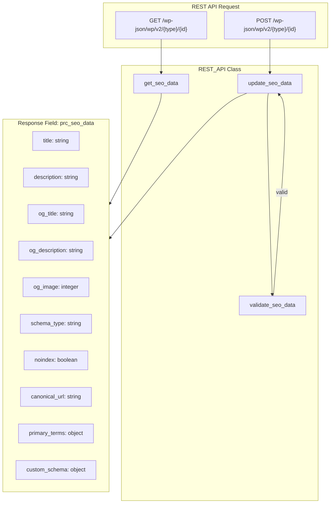

## Complete Data Flow Overview

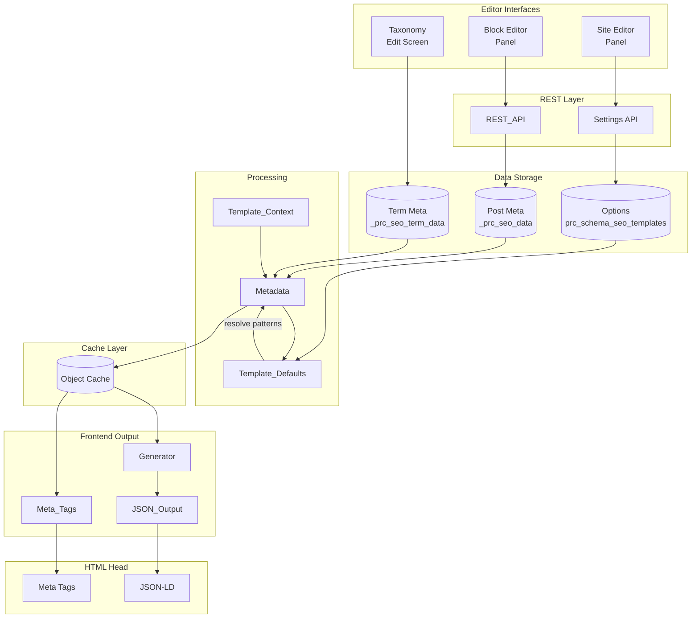
